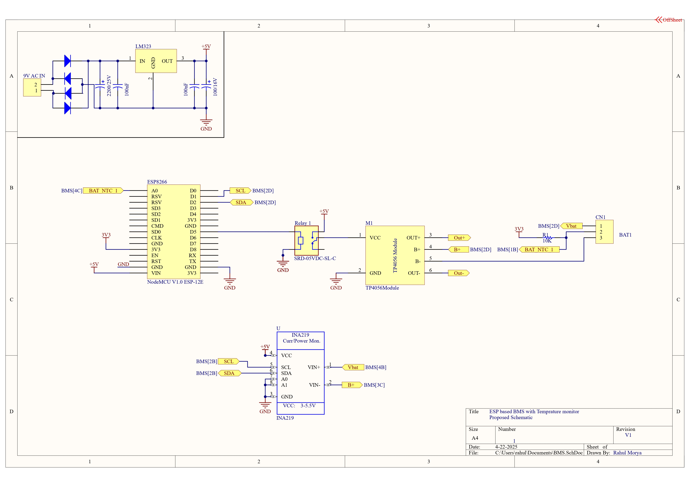

# Battery-Management-System

A smart BMS using ESP8266 to monitor battery voltage/current (INA219), control charging (TP4056 via Relay), and measure temperature (NTC).

This Project is under documentation 

